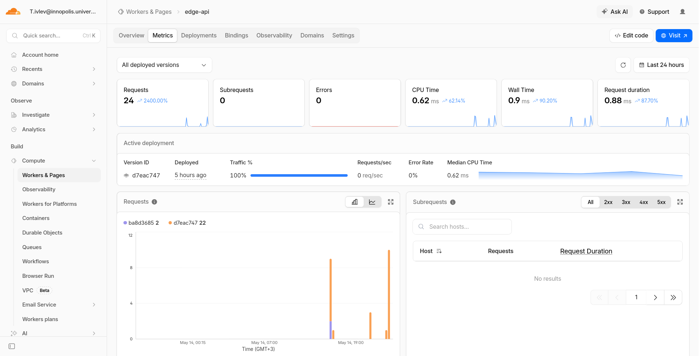

# Cloudflare Workers Edge Deployment -- Lab 17

**Name:** Timofey Ivlev t.ivlev@innopolis.university  
**Lab Points:** 20 pts  
**Date:** May 14, 2026  

> Note: To complete this task, I used a Netherlands-based VPN to be able to use Cloudflare services from Russia. 

---

## Task 1 — Cloudflare Setup (3 pts)
  
### 1. **Create Account**
I created a Cloudflare account using my university email address, and followed the instructions to connect it to worker.dev, which is a free hosting service for Cloudflare Workers, it allows you to deploy your Workers applications without needing to set up your own domain or hosting, similar to GitHub Pages or Vercel, but specifically designed for Cloudflare Workers, it provides a unique subdomain.workers.dev.
### 2. **Create Project**

Below is log if this step, however, the app did not suggested the `Worker only` template, so I decided to choose `Worker + Durable Objects` template:
```log
╭ Create an application with Cloudflare Step 1 of 3
│
├ In which directory do you want to create your application?
│ dir ./edge-api
│
├ What would you like to start with?
│ category Hello World example
│
╰ Which template would you like to use? 
├ Which template would you like to use?
│ type Worker + Durable Objects
│
├ Which language do you want to use?
│ lang TypeScript
│
├ Copying template files
│ files copied to project directory
│
├ Updating name in `package.json`
│ updated `package.json`
│
├ Installing dependencies
│ installed via `npm install`
│
├ Do you want to add an AGENTS.md file to help AI coding tools understand Cloudflare
 APIs?
│ yes agents
│
╰ Application created 

╭ Configuring your application for Cloudflare Step 2 of 3
│
├ Installing wrangler A command line tool for building Cloudflare Workers
│ installed via `npm install wrangler --save-dev`
│
├ Retrieving current workerd compatibility date
│ compatibility date 2026-05-14
│
├ Generating types for your application
│ generated to `./worker-configuration.d.ts` via `npm run cf-typegen`
│
├ Installing @types/node
│ installed via npm
│
├ You're in an existing git repository. Do you want to use git for version control?
│ yes git
│
╰ Application configured 

╭ Deploy with Cloudflare Step 3 of 3
│
├ Do you want to deploy your application?
│ no deploy via `npm run deploy`
│
╰ Done 

────────────────────────────────────────────────────────────
🎉  SUCCESS  Application created successfully!
```
### 3. **Authenticate CLI**
Authenticated the Wrangler CLI with my Cloudflare account using `wrangler login`,  and then I ran `wrangler whoami`:
```log
npx wrangler whoami

 ⛅️ wrangler 4.90.1
───────────────────
Getting User settings...
👋 You are logged in with an OAuth Token, associated with the email t.ivlev@innopolis.university.
┌────────────────────────────────────────┬──────────────────────────────────┐
│ Account Name                           │ Account ID                       │
├────────────────────────────────────────┼──────────────────────────────────┤
│ T.ivlev@innopolis.university's Account │ b4d862615fb40c19efb656814061beb1 │
└────────────────────────────────────────┴──────────────────────────────────┘
...
```

`wrangler.jsonc` allows you to configure your Cloudflare Worker project, it contains settings such as the name of your Worker, the type of Worker (e.g., `javascript`, `typescript`), the compatibility date, and other options that control how your Worker is built and deployed. It is essential for defining the behavior of your Worker and ensuring it runs correctly on the Cloudflare platform.

### 4. **Explore Platform Concepts**

**Workers Runtime:** Cloudflare Workers runs on V8 isolates, not traditional containers or VMs. Each request gets a fresh isolate -- lightweight, fast cold starts (under 5ms), no long-running process to maintain. The runtime is based on the Service Workers API (`fetch` handler) and supports ES modules. Unlike Node.js, there is no filesystem access or raw TCP sockets; everything goes through Workers-specific APIs like `fetch`, `WebSocket`, and platform bindings.

**workers.dev URLs:** Every Worker deployed gets a public URL in the format `https://<worker-name>.<your-subdomain>.workers.dev`. This is a free, automatic subdomain that lets you test and share your Worker without owning a custom domain. It is great for prototyping and labs. Behind the scenes, Cloudflare routes requests to the nearest edge datacenter that runs your Worker.

**Bindings (vars, secrets, KV):** Bindings are how Workers connect to Cloudflare platform resources. Instead of using connection strings or SDK configs, you declare bindings in `wrangler.jsonc` and they appear on the `env` object in your code:
- **vars**: Plaintext environment variables, good for non-sensitive config (app name, version). Not suitable for secrets because they are visible in `wrangler.jsonc` and committed to git.
- **secrets**: Encrypted at rest, set via `wrangler secret put`. They appear on `env` just like vars but are never exposed in config files or the dashboard UI after creation.
- **KV namespaces**: Global, eventually-consistent key-value store. You create a namespace, bind it to your Worker, and read/write via `env.<BINDING>.get()` and `env.<BINDING>.put()`. Good for counters, settings, small state.

## Task 2 — Build and Deploy a Worker API (4 pts)

### Implementation

I rewrote the generated `src/index.ts` to implement a proper HTTP API with 5 endpoints. The Durable Objects template code was replaced entirely since this lab does not need DO -- Workers alone are sufficient.

**Routes implemented:**

| Method | Path | Description |
|--------|------|-------------|
| GET | `/` | General app info, returns app name, course, message, timestamp |
| GET | `/health` | Health check, returns status and uptime |
| GET | `/edge` | Edge metadata from `request.cf` (colo, country, city, asn, etc.) |
| GET | `/counter` | KV-backed persistent counter, increments on each request |
| GET | `/settings` | Shows configured vars (not secrets) and which secrets exist |

The code lives in `LAB17/edge-api/src/index.ts`. Key design choices:
- Single `fetch` handler with route matching based on `url.pathname`
- `console.log` on every request for observability
- JSON responses everywhere with proper `Content-Type` headers
- 404 handler for unmatched routes

### Local Testing

Started the dev server with `npx wrangler dev`:

```log
[wrangler:info] Ready on http://localhost:8787
```

All routes tested locally with curl:

```json
// GET /
{"app":"edge-api","course":"devops-core","message":"Hello from Cloudflare Workers!","timestamp":"2026-05-14T10:24:51.403Z"}

// GET /health
{"status":"ok","uptime":"all good here","timestamp":"2026-05-14T10:25:03.881Z"}

// GET /edge
{"colo":"AMS","country":"NL","city":"Amsterdam","asn":24875,"httpProtocol":"HTTP/1.1","tlsVersion":"TLSv1.3","timezone":"Europe/Amsterdam","latitude":"52.37403","longitude":"4.88969","timestamp":"2026-05-14T10:25:03.934Z"}

// GET /counter
{"visits":1,"message":"This counter persists across deploys via KV"}
{"visits":2,"message":"This counter persists across deploys via KV"}
{"visits":3,"message":"This counter persists across deploys via KV"}

// GET /settings
{"app_name":"edge-api","course_name":"devops-core","secrets_configured":["API_TOKEN","ADMIN_EMAIL"],"note":"Secret values are never shown -- they stay encrypted"}

// GET /nonexistent (404)
{"error":"Not Found","path":"/nonexistent"}
```

Console logging confirmed working -- each request prints path, colo, and country.

### Deployment

Deployed with `npx wrangler deploy`:

```log
Total Upload: 2.24 KiB / gzip: 0.81 KiB
Worker Startup Time: 3 ms
Deployed edge-api triggers (5.46 sec)
  https://edge-api.t-ivlev.workers.dev
Current Version ID: d7eac747-73c1-451f-93ca-aae30e7dd71d
```

Public URL: **https://edge-api.t-ivlev.workers.dev**

All endpoints verified working on the public URL (see Task 3 for /edge response captured from production).

### Git

The project is tracked in the existing git repo at `LAB17/edge-api/`.

---

## Task 3 — Global Edge Behavior (4 pts)

### Edge Metadata Endpoint

The `/edge` endpoint returns `request.cf` metadata. This object is injected by Cloudflare's runtime and contains information about the incoming request's point of presence, geography, and connection properties.

Fields returned: `colo`, `country`, `city`, `asn`, `httpProtocol`, `tlsVersion`, `timezone`, `latitude`, `longitude`.

### Public Edge Execution Evidence

Deployed Worker response from the public URL:

```json
{
    "colo": "AMS",
    "country": "NL",
    "city": "Amsterdam",
    "asn": 24875,
    "httpProtocol": "HTTP/2",
    "tlsVersion": "TLSv1.3",
    "timezone": "Europe/Amsterdam",
    "latitude": "52.37403",
    "longitude": "4.88969",
    "timestamp": "2026-05-14T10:26:08.918Z"
}
```

This shows my request hit the Amsterdam (AMS) colo. The ASN 24875 belongs to an ISP in the Netherlands. The protocol is HTTP/2 over TLS 1.3 -- this is automatically handled by Cloudflare's edge, I did not configure any of this.

### How Global Distribution Works

Workers runs on Cloudflare's global network of 330+ data centers. When you deploy a Worker, the code is distributed to every data center automatically -- there is no region selection step. When a request comes in, it hits the nearest data center to the user, and the Worker executes right there (at the "edge").

Compare this to Kubernetes or VM-based platforms: you manually pick regions (e.g., us-east-1, eu-west-1), provision nodes, and handle replication yourself. Workers eliminates all of that -- one `wrangler deploy` and your code is everywhere.

There is no "deploy to 3 regions" step because Cloudflare's edge is not a set of regions you choose from. The entire network is your deployment target. Every colo gets your code.

### Routing Concepts

- **workers.dev**: Free subdomain (`<name>.<subdomain>.workers.dev`) for quick deployment. No custom domain needed. Used in this lab.
- **Routes**: Attach a Worker to specific URL patterns on a Cloudflare-managed zone (your own domain proxied through Cloudflare). More control, requires DNS setup.
- **Custom Domains**: Make your Worker the origin for any domain/subdomain, with automatic SSL. Requires domain to be on Cloudflare.

---

## Task 4 — Configuration, Secrets & Persistence (3 pts)

### Environment Variables

Two plaintext vars configured in `wrangler.jsonc`:

```json
"vars": {
    "APP_NAME": "edge-api",
    "COURSE_NAME": "devops-core"
}
```

These are visible in the config file and accessible via `env.APP_NAME` and `env.COURSE_NAME` in the Worker code. Plaintext vars are not suitable for secrets because they are committed to git and visible in the Cloudflare dashboard.

### Secrets

Two secrets configured via CLI:

```bash
$ echo "secret-token-xyz-123" | npx wrangler secret put API_TOKEN
✨ Success! Uploaded secret API_TOKEN

$ echo "admin@devops-lab17.local" | npx wrangler secret put ADMIN_EMAIL
✨ Success! Uploaded secret ADMIN_EMAIL
```

Both secrets appear on the `env` object in code but are never exposed in responses, config files, or the dashboard UI. The deployment history shows "Secret Change" entries for these operations.

### KV Persistence

Created a KV namespace named `SETTINGS`:

```bash
$ npx wrangler kv namespace create SETTINGS
🌀 Creating namespace with title "SETTINGS"
✨ Success!
Add the following to your configuration file:
{
  "kv_namespaces": [
    {
      "binding": "SETTINGS",
      "id": "08e385de3e704c76b5a9b07ae285fe45"
    }
  ]
}
```

The counter endpoint (`/counter`) reads the current visit count from KV, increments it, and writes it back. This demonstrates persistent state that survives Worker restarts and redeploys.

### Persistence Verification

After the first deployment, the counter was at 1. I then made a code change (added `version: "v2"` to the root response) and deployed again. Counter went from 1 to 2 -- confirming KV persistence survives redeploys:

```json
// After first deploy
{"visits": 1, "message": "This counter persists across deploys via KV"}

// After second deploy (v2)
{"visits": 2, "message": "This counter persists across deploys via KV"}
```

KV state is independent of Worker version -- it persists until explicitly deleted.

---

## Task 5 — Observability & Operations (3 pts)

### Logs

Added `console.log` in the fetch handler:

```ts
console.log("request", {
    path,
    method: request.method,
    colo: request.cf?.colo,
    country: request.cf?.country,
});
```

Local dev server output confirmed logs are working:

```log
npx wrangler tail

 ⛅️ wrangler 4.90.1 (update available 4.91.0)
─────────────────────────────────────────────
Successfully created tail, expires at 2026-05-14T21:44:11Z
Connected to edge-api, waiting for logs...
GET https://edge-api.t-ivlev.workers.dev/ - Ok @ 5/14/2026, 6:57:00 PM
  (log) request { path: '/', method: 'GET', colo: 'AMS', country: 'NL' }
GET https://edge-api.t-ivlev.workers.dev/favicon.ico - Ok @ 5/14/2026, 6:57:00 PM
  (log) request { path: '/favicon.ico', method: 'GET', colo: 'AMS', country: 'NL' }
GET https://edge-api.t-ivlev.workers.dev/health - Ok @ 5/14/2026, 6:57:06 PM
  (log) request { path: '/health', method: 'GET', colo: 'AMS', country: 'NL' }
GET https://edge-api.t-ivlev.workers.dev/favicon.ico - Ok @ 5/14/2026, 6:57:06 PM
  (log) request { path: '/favicon.ico', method: 'GET', colo: 'AMS', country: 'NL' }
GET https://edge-api.t-ivlev.workers.dev/edge - Ok @ 5/14/2026, 6:57:14 PM
  (log) request { path: '/edge', method: 'GET', colo: 'AMS', country: 'NL' }
GET https://edge-api.t-ivlev.workers.dev/favicon.ico - Ok @ 5/14/2026, 6:57:14 PM
  (log) request { path: '/favicon.ico', method: 'GET', colo: 'AMS', country: 'NL' }
GET https://edge-api.t-ivlev.workers.dev/counter - Ok @ 5/14/2026, 6:57:23 PM
  (log) request { path: '/counter', method: 'GET', colo: 'AMS', country: 'NL' }
```

Cloudflare dashboard screenshot:


### Deployment History

Viewed with `npx wrangler deployments list`. Five deployments total:

```log
1. 2026-05-14T10:22:27Z -- Upload (Automatic, initial Worker creation)
2. 2026-05-14T10:22:29Z -- Secret Change (API_TOKEN)
3. 2026-05-14T10:22:42Z -- Secret Change (ADMIN_EMAIL)
4. 2026-05-14T10:25:44Z -- Unknown (first code deploy, v1)
5. 2026-05-14T10:29:14Z -- Unknown (second code deploy, v2)
```

### Rollback

I deployed v2 (added `version: "v2"` field to root endpoint), then rolled back to v1:

```bash
$ npx wrangler rollback d7eac747-73c1-451f-93ca-aae30e7dd71d

? Please provide an optional message for this rollback: Rolling back to v1 for lab demo
WARNING: You are about to rollback to Worker Version d7eac747...
? Are you sure you want to deploy this Worker Version to 100% of traffic? yes

SUCCESS: Worker Version d7eac747... has been deployed to 100% of traffic.
Current Version ID: d7eac747-73c1-451f-93ca-aae30e7dd71d
```

Before rollback: `{"app":"edge-api","version":"v2",...}`
After rollback: `{"app":"edge-api","course":"devops-core","message":"Hello from Cloudflare Workers!",...}` -- no `version` field, confirming v1 is back.

---

## Task 6 — Documentation & Comparison (3 pts)

For this part I created `WORKERS.md` as required by the lab instructions, you can find all the details from this chapter in that file. 

---

## Lab Checklist Verification

- [x] Cloudflare account created
- [x] Workers project initialized
- [x] Wrangler authenticated
- [x] Worker deployed to `workers.dev`
- [x] `/health` endpoint working
- [x] Edge metadata endpoint implemented
- [x] At least 1 plaintext variable configured (APP_NAME, COURSE_NAME)
- [x] At least 2 secrets configured (API_TOKEN, ADMIN_EMAIL)
- [x] KV namespace created and bound (SETTINGS)
- [x] Persistence verified after redeploy (counter 1 -> 2)
- [x] Logs reviewed (console.log, local dev output)
- [x] Deployment history viewed (5 deployments)
- [x] Rollback performed (v2 -> v1)
- [x] `WORKERS.md` documentation complete
- [x] Kubernetes comparison documented