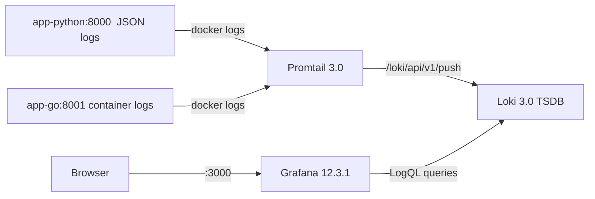
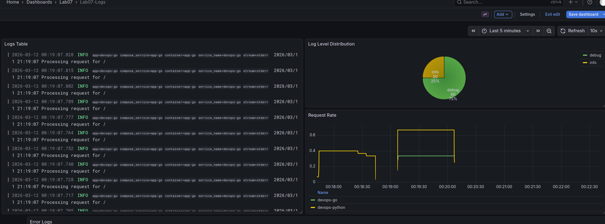
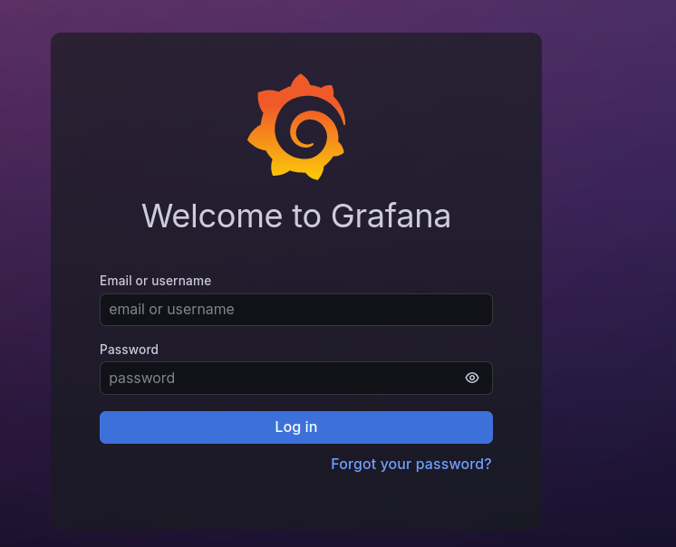

# Lab 07 - Observability and Logging with Loki Stack

**Name:** Timofey Ivlev t.ivlev@innopolis.university
**Date:** 2026-03-12
**Lab Points:** 10 + 2.5 bonus

## 1. Architecture

The monitoring stack is deployed with Docker Compose and includes Loki (storage/query), Promtail (collection), Grafana (visualization), and two instrumented applications.



Files:
- `monitoring/docker-compose.yml`
- `monitoring/loki/config.yml`
- `monitoring/promtail/config.yml`

## 2. Task 1 - Deploying Loki Stack (with my terminal outputs)

1. Preparing Grafana credentials:

```bash
cd monitoring
cp .env.example .env
# some hard password should be used...
```

2. Deploy stack:

```bash
cd monitoring
docker compose up -d --build
# terminal output
```
```
[+] Running 7/7
 ✔ app-go                           Built                                                                     0.0s 
 ✔ app-python                       Built                                                                     0.0s 
 ✔ Container monitoring-loki-1      Running                                                                   0.0s 
 ✔ Container app-go                 Running                                                                   0.0s 
 ✔ Container app-python             Running                                                                   0.0s 
 ✔ Container monitoring-grafana-1   Started                                                                   0.7s 
 ✔ Container monitoring-promtail-1  Running                                                                   0.0s 
```
```bash
docker compose ps
```
#terminal output
```
docker compose ps
WARN[0000] /home/timofey/Desktop/Study/B3_T2_Spring_2026/DevOps/DevOps-Core-Course/monitoring/docker-compose.yml: t
he attribute `version` is obsolete, it will be ignored, please remove it to avoid potential confusion              NAME                    IMAGE                    COMMAND                  SERVICE      CREATED              STATUS 
                       PORTS                                                                                       app-go                  monitoring-app-go        "/app/app"               app-go       2 days ago           Up 28 h
ours                   0.0.0.0:8001->8080/tcp, [::]:8001->8080/tcp                                                 app-python              monitoring-app-python    "python app.py"          app-python   2 days ago           Up 28 h
ours                   0.0.0.0:8000->5000/tcp, [::]:8000->5000/tcp                                                 monitoring-grafana-1    grafana/grafana:12.3.1   "/run.sh"                grafana      About a minute ago   Up Abou
t a minute (healthy)   0.0.0.0:3000->3000/tcp, [::]:3000->3000/tcp                                                 monitoring-loki-1       grafana/loki:3.0.0       "/usr/bin/loki -conf…"   loki         2 days ago           Up 28 h
ours (healthy)         0.0.0.0:3100->3100/tcp, [::]:3100->3100/tcp                                                 monitoring-promtail-1   grafana/promtail:3.0.0   "/usr/bin/promtail -…"   promtail     2 days ago           Up 28 h
ours                   0.0.0.0:9080->9080/tcp, [::]:9080->9080/tcp                                                 
```

3. Verification of core services:

```bash
timofey@lenovoARH7:~/Desktop/Study/B3_T2_Spring_2026/DevOps/DevOps-Core-Course/monitoring$ curl http://localhost:3100/ready
ready
```
```bash
curl http://localhost:9080/targets
# the output is a whole webpage, it screenshot is available at monitoring/docs/screenshots/lab07-promtail-targets.png
timofey@lenovoARH7:~/Desktop/Study/B3_T2_Spring_2026/DevOps/DevOps-Core-Course/monitoring$ curl http://localhost:3000/api/health
{
  "database": "ok",
  "version": "12.3.1",
  "commit": "3a1c80ca7ce612f309fdc99338dd3c5e486339be"
```

4. Opening Grafana and verifying resources:
- Verified data source `Loki`
- Dashboard `Lab07-Logs` is auto-loaded from `monitoring/grafana/dashboards/lab07-logs-dashboard.json`
Here is the screenshot (avaiable as file in monitoring/docs/screenshots/lab07-grafana-login.png):


## 3. Task 2: part 1 - Configuration

### Docker Compose highlights

The stack uses production-oriented defaults:
- Resource limits and reservations for all services
- Health checks for Loki and Grafana
- Anonymous Grafana access disabled
- App labels for Promtail filtering (`logging=promtail`, `app=devops-*`)

Snippet from `monitoring/docker-compose.yml`:

```yaml
services:
  grafana:
    environment:
      GF_AUTH_ANONYMOUS_ENABLED: "false"
      GF_SECURITY_ADMIN_USER: "${GF_SECURITY_ADMIN_USER:-admin}"
      GF_SECURITY_ADMIN_PASSWORD: "${GF_SECURITY_ADMIN_PASSWORD:-admin-change-me}"
```

### Loki 3.0 TSDB configuration

`monitoring/loki/config.yml` uses:
- Schema v13
- TSDB store with filesystem backend
- Retention enabled through compactor
- 7 days retention (`168h`)

Snippet:

```yaml
schema_config:
  configs:
    - from: 2024-01-01
      store: tsdb
      object_store: filesystem
      schema: v13

limits_config:
  retention_period: 168h
```

### Promtail configuration

`monitoring/promtail/config.yml` uses Docker service discovery and label filtering:

```yaml
docker_sd_configs:
  - host: unix:///var/run/docker.sock
    filters:
      - name: label
        values:
          - logging=promtail
```

Container name and app labels are relabeled to LogQL-friendly labels (`container`, `app`, `compose_service`).

## 4. Task 2: part 2 - Application Logging

`app_python/app.py` now emits structured JSON logs for:
- startup event
- each HTTP request (method/path/status/client_ip/user_agent/duration)
- unhandled exceptions (with stack trace)

Example emitted log line:

```json
{"timestamp":"2026-03-09T12:00:00+00:00","level":"INFO","logger":"app","message":"HTTP request processed","event":"http_request","method":"GET","path":"/health","status_code":200,"client_ip":"172.18.0.1","user_agent":"curl/8.5.0","duration_ms":1.24}
```

Generated sample traffic:

```bash
for i in {1..20}; do curl -s http://localhost:8000/ > /dev/null; done
for i in {1..20}; do curl -s http://localhost:8000/health > /dev/null; done
for i in {1..20}; do curl -s http://localhost:8001/ > /dev/null; done
```



## 5. Task 3 - Dashboard

Created dashboard `Lab07-Logs` with these 4 panels:

1. Logs Table
- Query: `{app=~"devops-.*"}`
- Visualization: Logs

2. Request Rate
- Query: `sum by (app) (rate({app=~"devops-.*"}[1m]))`
- Visualization: Time series

3. Error Logs
- Query: `{app=~"devops-.*"} | json | level="ERROR"`
- Visualization: Logs

4. Log Level Distribution
- Query: `sum by (level) (count_over_time({app=~"devops-.*"} | json [5m]))`
- Visualization: Pie chart or Stat

Dashboard-as-code location:
- `monitoring/grafana/dashboards/lab07-logs-dashboard.json`

Useful Explore queries:

```logql
{job="docker"}
{app="devops-python"}
{app="devops-python"} |= "ERROR"
{app="devops-python"} | json | method="GET"
```

Screenshots of the dashboard are available in `monitoring/docs/screenshots/*`

## 6. Task 4 - Production Configuration

Implemented hardening and runtime controls:
- Resource limits and reservations on all services (`deploy.resources`)
- Loki retention: 7 days (`168h`)
- Grafana anonymous auth disabled
- Admin credentials via `.env` and Ansible template (`ansible/roles/monitoring/templates/env.j2`)
- Health checks for Loki and Grafana

Security notes:
- Promtail uses Docker socket read-only mount; this is acceptable for a lab, but in production isolate access and enforce host hardening.
- Do not commit `monitoring/.env` (ignored via `.gitignore`).

Screenshot proof of presence of the grafana login stage:


## 7. Testing

I ran these checks after deployment:

```bash
cd monitoring
docker compose ps 
# output present in first chapter

# docker compose logs of each service
docker compose logs --tail=1 loki
# output
loki-1  | level=info ts=2026-03-11T21:39:40.89878524Z caller=reporter.go:305 msg="failed to send usage report" retries=3 err="Post \"https://stats.grafana.org/loki-usage-report\": context deadline exceeded (Client.Timeout exceeded while awaiting headers)"


docker compose logs --tail=1 promtail
# output
promtail-1  | level=info ts=2026-03-10T16:33:44.728248561Z caller=target_group.go:128 msg="added Docker target" containerID=e568af9f83eaccdafd21b5eb2152fd32d41d893c2b45298da169c00e15c10ce0


docker compose logs --tail=1 grafana
# output
grafana-1  | logger=cleanup t=2026-03-11T21:40:02.598750039Z level=info msg="Completed cleanup jobs" duration=58.216871ms

curl -s http://localhost:3100/ready
ready
curl -s http://localhost:9080/targets | head -n 3
<!DOCTYPE html>
<html lang="en">
    <head>
...

curl -s http://localhost:3000/api/health
{
  "database": "ok",
  "version": "12.3.1",
  "commit": "3a1c80ca7ce612f309fdc99338dd3c5e486339be"

```

## Task 4 bonus - Ansible Automation checks

### Configuration of Ansible files:

As the lab07 requested, I have implemented Ansible automation for deploying the monitoring stack. The role is designed to be idempotent and uses Jinja2 templates for configuration files.


Implemented files:
- `ansible/roles/monitoring/defaults/main.yml`
- `ansible/roles/monitoring/tasks/main.yml`
- `ansible/roles/monitoring/tasks/setup.yml`
- `ansible/roles/monitoring/tasks/deploy.yml`
- `ansible/roles/monitoring/tasks/configure_grafana.yml`
- `ansible/roles/monitoring/templates/docker-compose.yml.j2`
- `ansible/roles/monitoring/templates/loki-config.yml.j2`
- `ansible/roles/monitoring/templates/promtail-config.yml.j2`
- `ansible/roles/monitoring/templates/grafana-dashboards.yml.j2`
- `ansible/roles/monitoring/templates/lab07-logs-dashboard.json.j2`
- `ansible/playbooks/deploy-monitoring.yml`

Behavior:
- Creates monitoring directories and templated configs on target host.
- Deploys stack idempotently using `community.docker.docker_compose_v2`.
- Waits for Loki and Grafana health endpoints.
- Ensures Grafana has Loki datasource using API check/create flow.

### First run of the Ansible playbook:
First run of ansible playbook, was unsuccessful due to incorrect docker images (forgot to update image from example template). It failed on the docker compose task with error about missing image:

```bash
ansible-playbook playbooks/deploy-monitoring.yml --vault-password-file .vault_pass

PLAY [Deploy monitoring stack] ************************************************************************************

TASK [Gathering Facts] ********************************************************************************************
ok: [lab05-vm]

TASK [docker : Create apt keyrings directory] *********************************************************************
ok: [lab05-vm]

TASK [docker : Download Docker GPG key] ***************************************************************************
changed: [lab05-vm]

TASK [docker : Convert Docker GPG key to apt keyring format] ******************************************************
changed: [lab05-vm]

TASK [docker : Set Docker apt keyring permissions] ****************************************************************
ok: [lab05-vm]

TASK [docker : Add Docker apt repository] *************************************************************************
changed: [lab05-vm]

TASK [docker : Install Docker engine packages] ********************************************************************
changed: [lab05-vm]

TASK [docker : Install docker Python binding package] *************************************************************
changed: [lab05-vm]

TASK [docker : Ensure Docker service is enabled and running] ******************************************************
ok: [lab05-vm]

TASK [docker : Add users to docker group] *************************************************************************
changed: [lab05-vm] => (item=ubuntu)

TASK [monitoring : Prepare monitoring stack files] ****************************************************************
included: /home/timofey/Desktop/Study/B3_T2_Spring_2026/DevOps/DevOps-Core-Course/ansible/roles/monitoring/tasks/se
tup.yml for lab05-vm                                                                                               
TASK [monitoring : Create monitoring directory structure] *********************************************************
changed: [lab05-vm] => (item=/opt/monitoring)
changed: [lab05-vm] => (item=/opt/monitoring/loki)
changed: [lab05-vm] => (item=/opt/monitoring/promtail)
changed: [lab05-vm] => (item=/opt/monitoring/grafana)
changed: [lab05-vm] => (item=/opt/monitoring/grafana/provisioning)
changed: [lab05-vm] => (item=/opt/monitoring/grafana/provisioning/dashboards)
changed: [lab05-vm] => (item=/opt/monitoring/grafana/dashboards)

TASK [monitoring : Render monitoring compose manifest] ************************************************************
changed: [lab05-vm]

TASK [monitoring : Render monitoring environment file] ************************************************************
changed: [lab05-vm]

TASK [monitoring : Render Loki config] ****************************************************************************
changed: [lab05-vm]

TASK [monitoring : Render Promtail config] ************************************************************************
changed: [lab05-vm]

TASK [monitoring : Render Grafana dashboard provisioning] *********************************************************
changed: [lab05-vm]

TASK [monitoring : Render Lab07 dashboard JSON] *******************************************************************
changed: [lab05-vm]

TASK [monitoring : Deploy monitoring stack services] **************************************************************
included: /home/timofey/Desktop/Study/B3_T2_Spring_2026/DevOps/DevOps-Core-Course/ansible/roles/monitoring/tasks/de
ploy.yml for lab05-vm                                                                                              
TASK [monitoring : Ensure Docker service is running] **************************************************************
ok: [lab05-vm]

TASK [monitoring : Start monitoring stack via Docker Compose] *****************************************************
[WARNING]: Cannot parse event from line: 'time="2026-03-12T09:02:58Z" level=warning msg="/opt/monitoring/docker-
compose.yml: the attribute `version` is obsolete, it will be ignored, please remove it to avoid potential
confusion"'. Please report this at https://github.com/ansible-
collections/community.docker/issues/new?assignees=&labels=&projects=&template=bug_report.md
[WARNING]: Docker compose: image timofeq1/devops-info-service:latest: Error pull access denied for
timofeq1/devops-info-service, repository does not exist or may require 'docker login'
[WARNING]: Docker compose: image grafana/promtail:3.0.0: Interrupted
[WARNING]: Docker compose: image timofeq1/devops-info-service-go:latest: Interrupted
[WARNING]: Docker compose: image grafana/loki:3.0.0: Interrupted
[WARNING]: Docker compose: image grafana/grafana:12.3.1: Interrupted
fatal: [lab05-vm]: FAILED! => {"actions": [{"id": "grafana/loki:3.0.0", "status": "Pulling", "what": "image"}, {"id
": "grafana/grafana:12.3.1", "status": "Pulling", "what": "image"}, {"id": "timofeq1/devops-info-service:latest", "status": "Pulling", "what": "image"}, {"id": "grafana/promtail:3.0.0", "status": "Pulling", "what": "image"}, {"id": "timofeq1/devops-info-service-go:latest", "status": "Pulling", "what": "image"}], "changed": true, "cmd": "/usr/bin/docker compose --ansi never --progress plain --project-directory /opt/monitoring up --detach --no-color --quiet-pull --pull missing --remove-orphans --", "containers": [], "images": null, "msg": "General error: Error response from daemon: pull access denied for timofeq1/devops-info-service, repository does not exist or may require 'docker login'", "rc": 1, "stderr": "time=\"2026-03-12T09:02:58Z\" level=warning msg=\"/opt/monitoring/docker-compose.yml: the attribute `version` is obsolete, it will be ignored, please remove it to avoid potential confusion\"\n Image grafana/loki:3.0.0 Pulling \n Image grafana/grafana:12.3.1 Pulling \n Image timofeq1/devops-info-service:latest Pulling \n Image grafana/promtail:3.0.0 Pulling \n Image timofeq1/devops-info-service-go:latest Pulling \n Image timofeq1/devops-info-service:latest Error pull access denied for timofeq1/devops-info-service, repository does not exist or may require 'docker login'\n Image grafana/promtail:3.0.0 Interrupted \n Image timofeq1/devops-info-service-go:latest Interrupted \n Image grafana/loki:3.0.0 Interrupted \n Image grafana/grafana:12.3.1 Interrupted \nError response from daemon: pull access denied for timofeq1/devops-info-service, repository does not exist or may require 'docker login'\n", "stderr_lines": ["time=\"2026-03-12T09:02:58Z\" level=warning msg=\"/opt/monitoring/docker-compose.yml: the attribute `version` is obsolete, it will be ignored, please remove it to avoid potential confusion\"", " Image grafana/loki:3.0.0 Pulling ", " Image grafana/grafana:12.3.1 Pulling ", " Image timofeq1/devops-info-service:latest Pulling ", " Image grafana/promtail:3.0.0 Pulling ", " Image timofeq1/devops-info-service-go:latest Pulling ", " Image timofeq1/devops-info-service:latest Error pull access denied for timofeq1/devops-info-service, repository does not exist or may require 'docker login'", " Image grafana/promtail:3.0.0 Interrupted ", " Image timofeq1/devops-info-service-go:latest Interrupted ", " Image grafana/loki:3.0.0 Interrupted ", " Image grafana/grafana:12.3.1 Interrupted ", "Error response from daemon: pull access denied for timofeq1/devops-info-service, repository does not exist or may require 'docker login'"], "stdout": "", "stdout_lines": []}                                             
PLAY RECAP ********************************************************************************************************
lab05-vm                   : ok=20   changed=13   unreachable=0    failed=1    skipped=0    rescued=0    ignored=0 
              
```

### Second run of the Ansible playbook:
After fixing the image reference in `ansible/group_vars/all.yml`, decrypting the vault file, and pushing the image to Docker Hub, I ran the playbook again to verify idempotency:
```bash
ansible-playbook playbooks/deploy-monitoring.yml --vault-password-file .vault_pass

PLAY [Deploy monitoring stack] ************************************************************************************

TASK [Gathering Facts] ********************************************************************************************
ok: [lab05-vm]

TASK [docker : Create apt keyrings directory] *********************************************************************
ok: [lab05-vm]

TASK [docker : Download Docker GPG key] ***************************************************************************
ok: [lab05-vm]

TASK [docker : Convert Docker GPG key to apt keyring format] ******************************************************
skipping: [lab05-vm]

TASK [docker : Set Docker apt keyring permissions] ****************************************************************
ok: [lab05-vm]

TASK [docker : Add Docker apt repository] *************************************************************************
ok: [lab05-vm]

TASK [docker : Install Docker engine packages] ********************************************************************
ok: [lab05-vm]

TASK [docker : Install docker Python binding package] *************************************************************
ok: [lab05-vm]

TASK [docker : Ensure Docker service is enabled and running] ******************************************************
ok: [lab05-vm]

TASK [docker : Add users to docker group] *************************************************************************
ok: [lab05-vm] => (item=ubuntu)

TASK [monitoring : Prepare monitoring stack files] ****************************************************************
included: /home/timofey/Desktop/Study/B3_T2_Spring_2026/DevOps/DevOps-Core-Course/ansible/roles/monitoring/tasks/se
tup.yml for lab05-vm                                                                                               
TASK [monitoring : Create monitoring directory structure] *********************************************************
ok: [lab05-vm] => (item=/opt/monitoring)
ok: [lab05-vm] => (item=/opt/monitoring/loki)
ok: [lab05-vm] => (item=/opt/monitoring/promtail)
ok: [lab05-vm] => (item=/opt/monitoring/grafana)
ok: [lab05-vm] => (item=/opt/monitoring/grafana/provisioning)
ok: [lab05-vm] => (item=/opt/monitoring/grafana/provisioning/dashboards)
ok: [lab05-vm] => (item=/opt/monitoring/grafana/dashboards)

TASK [monitoring : Render monitoring compose manifest] ************************************************************
changed: [lab05-vm]

TASK [monitoring : Render monitoring environment file] ************************************************************
ok: [lab05-vm]

TASK [monitoring : Render Loki config] ****************************************************************************
ok: [lab05-vm]

TASK [monitoring : Render Promtail config] ************************************************************************
ok: [lab05-vm]

TASK [monitoring : Render Grafana dashboard provisioning] *********************************************************
ok: [lab05-vm]

TASK [monitoring : Render Lab07 dashboard JSON] *******************************************************************
ok: [lab05-vm]

TASK [monitoring : Deploy monitoring stack services] **************************************************************
included: /home/timofey/Desktop/Study/B3_T2_Spring_2026/DevOps/DevOps-Core-Course/ansible/roles/monitoring/tasks/de
ploy.yml for lab05-vm                                                                                              
TASK [monitoring : Ensure Docker service is running] **************************************************************
ok: [lab05-vm]

TASK [monitoring : Start monitoring stack via Docker Compose] *****************************************************
[WARNING]: Cannot parse event from line: 'time="2026-03-12T09:18:51Z" level=warning msg="/opt/monitoring/docker-
compose.yml: the attribute `version` is obsolete, it will be ignored, please remove it to avoid potential
confusion"'. Please report this at https://github.com/ansible-
collections/community.docker/issues/new?assignees=&labels=&projects=&template=bug_report.md
changed: [lab05-vm]

TASK [monitoring : Wait for Loki port] ****************************************************************************
ok: [lab05-vm]

TASK [monitoring : Wait for Grafana port] *************************************************************************
ok: [lab05-vm]

TASK [monitoring : Wait for Loki readiness endpoint] **************************************************************
FAILED - RETRYING: [lab05-vm]: Wait for Loki readiness endpoint (20 retries left).
FAILED - RETRYING: [lab05-vm]: Wait for Loki readiness endpoint (19 retries left).
FAILED - RETRYING: [lab05-vm]: Wait for Loki readiness endpoint (18 retries left).
ok: [lab05-vm]

TASK [monitoring : Wait for Grafana health endpoint] **************************************************************
ok: [lab05-vm]

TASK [monitoring : Configure Grafana data source] *****************************************************************
included: /home/timofey/Desktop/Study/B3_T2_Spring_2026/DevOps/DevOps-Core-Course/ansible/roles/monitoring/tasks/co
nfigure_grafana.yml for lab05-vm                                                                                   
TASK [monitoring : Check whether Loki data source exists] *********************************************************
ok: [lab05-vm]

TASK [monitoring : Create Loki data source in Grafana] ************************************************************
changed: [lab05-vm]

PLAY RECAP ********************************************************************************************************
lab05-vm                   : ok=27   changed=3    unreachable=0    failed=0    skipped=1    rescued=0    ignored=0 
```
### Results of the second run:
As the result shows, the second run was mostly idempotent with only 3 tasks changing (rendering compose manifest, starting stack, and creating data source - the latter is expected to change on first run and be skipped on subsequent runs).

## 8. Challenges and Solutions

Challenge: Loki 3.0 TSDB config shape differs from older boltdb-shipper examples.
Solution: Implemented schema v13 + TSDB + filesystem and explicit compactor retention settings.

Challenge: App logs need to be query-friendly in LogQL.
Solution: Switched Python app logs to JSON with consistent field names (`level`, `method`, `path`, `status_code`, `client_ip`).

Challenge: Secure Grafana while keeping local setup simple.
Solution: Disabled anonymous auth and moved admin credentials to `.env` and Ansible env template.

Challenge: Bonus task requires idempotent automation.
Solution: Used `community.docker.docker_compose_v2` and conditional data source creation (`404` check then POST).

Challenge: Failed first Ansible run due to missing image reference.
Solution: Updated `ansible/group_vars/all.yml` to reference the correct image and pushed it to Docker Hub, then re-ran the playbook successfully.

## Checklist and Rubric Coverage

Checklist status:
- [x] Loki, Promtail, Grafana docker compose stack files created
- [x] Loki data source automation added in Ansible bonus role
- [x] Python app JSON structured logging implemented
- [x] Bonus app integration added (`app-go` in `monitoring/docker-compose.yml`)
- [x] LogQL queries documented for multiple scenarios
- [x] Dashboard panel definitions implemented as code (4 panels)
- [x] Resource limits configured for all services
- [x] Health checks configured
- [x] Grafana anonymous access disabled
- [x] Complete documentation created
- [x] Bonus Ansible role/playbook created
- [x] Runtime proof captured (manual evidence)

Rubric mapping:
- Stack Deployment (4 pts): `monitoring/docker-compose.yml`, `monitoring/loki/config.yml`, `monitoring/promtail/config.yml`
- App Integration (3 pts): `app_python/app.py`, labels and app services in `monitoring/docker-compose.yml`
- Dashboard (2 pts): `monitoring/grafana/dashboards/lab07-logs-dashboard.json` + Section 5 queries
- Production Config (1 pt): resource/security/health settings in compose and config files
- Documentation (2 pts): this file with setup/config/testing/challenges/evidence checklist
- Bonus Ansible (2.5 pts): `ansible/roles/monitoring/*`, `ansible/playbooks/deploy-monitoring.yml`