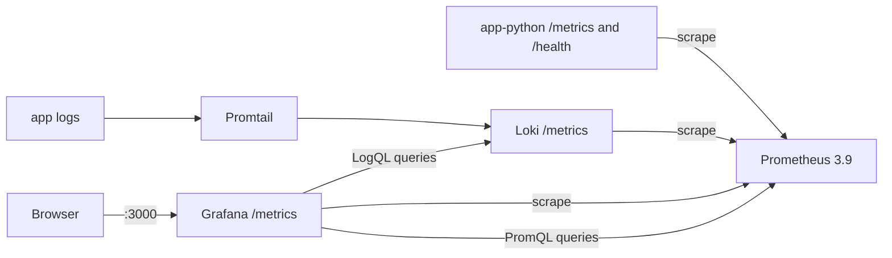
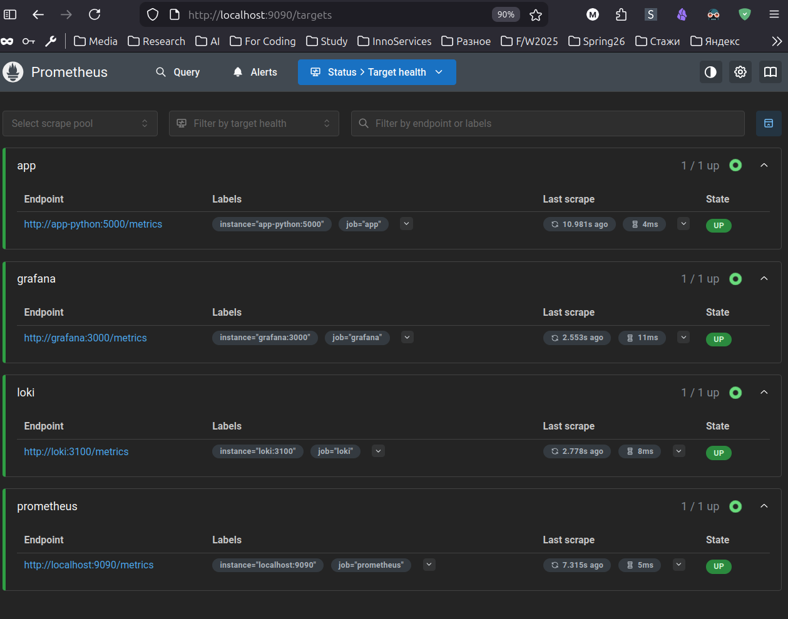
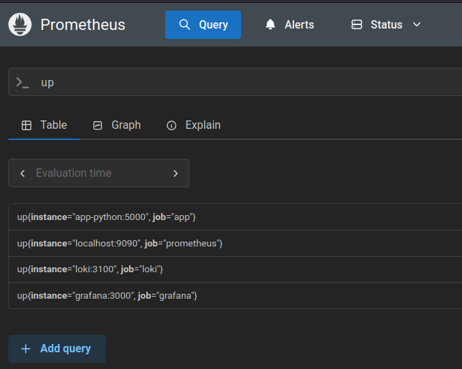

# Lab 08 - Metrics and Monitoring with Prometheus

**Name:** Timofey Ivlev t.ivlev@innopolis.university  
**Date:** 2026-03-19  
**Lab Points:** 10 + 2.5 bonus

## 1. Architecture

This lab extends the existing Lab 07 observability stack by adding Prometheus metrics collection and a metrics dashboard in Grafana.



Implemented files:
- `app_python/app.py`
- `app_python/requirements.txt`
- `monitoring/docker-compose.yml`
- `monitoring/prometheus/prometheus.yml`
- `monitoring/grafana/provisioning/datasources/datasources.yml`
- `monitoring/grafana/dashboards/lab08-metrics-dashboard.json`
- `ansible/roles/monitoring/defaults/main.yml`
- `ansible/roles/monitoring/templates/prometheus.yml.j2`
- `ansible/roles/monitoring/templates/lab08-metrics-dashboard.json.j2`

## 2. Application Instrumentation

### 2.1 Added metrics in FastAPI app

Instrumentation is implemented in `app_python/app.py`.

HTTP RED metrics:
- `http_requests_total{method, endpoint, status_code}` (Counter)
- `http_request_duration_seconds{method, endpoint, status_code}` (Histogram)
- `http_requests_in_progress{method, endpoint}` (Gauge)

Application-specific metrics:
- `devops_info_endpoint_calls_total{endpoint}` (Counter)
- `devops_info_system_collection_seconds` (Histogram)

Implementation notes:
- `/metrics` endpoint added using `generate_latest()` from `prometheus_client`.
- Endpoint labels are normalized via `normalize_endpoint(...)` to avoid high cardinality.
- Metrics are collected in middleware for both successful and failed requests.

### 2.2 Dependencies

Added:
- `prometheus-client==0.23.1` in `app_python/requirements.txt`
- `prometheus-client==0.23.1` in `app_python/requirements-dev.txt`

## 3. Prometheus Configuration

Prometheus is configured in `monitoring/prometheus/prometheus.yml` and started from `monitoring/docker-compose.yml`.

Key settings:
- scrape interval: `15s`
- evaluation interval: `15s`
- retention time: `15d`
- retention size: `10GB`

Scrape jobs:
- `prometheus` -> `localhost:9090`
- `app` -> `app-python:5000`, path `/metrics`
- `loki` -> `loki:3100`, path `/metrics`
- `grafana` -> `grafana:3000`, path `/metrics`

## 4. Dashboard Walkthrough

Custom dashboard file:
- `monitoring/grafana/dashboards/lab08-metrics-dashboard.json`

Panels implemented (7 panels):
1. Request Rate (timeseries)
- Query: `sum by (endpoint) (rate(http_requests_total[5m]))`

2. Error Rate (timeseries)
- Query: `sum(rate(http_requests_total{status_code=~"5.."}[5m]))`

3. Request Duration p95 (timeseries)
- Query: `histogram_quantile(0.95, sum by (le, endpoint) (rate(http_request_duration_seconds_bucket[5m])))`

4. Request Duration Heatmap (heatmap)
- Query: `sum by (le) (rate(http_request_duration_seconds_bucket[5m]))`

5. Active Requests (gauge)
- Query: `sum(http_requests_in_progress)`

6. Status Code Distribution (pie chart)
- Query: `sum by (status_code) (rate(http_requests_total[5m]))`

7. Application Uptime (stat)
- Query: `up{job="app"}`

## 5. PromQL Examples

1. Request rate per endpoint:
```promql
sum by (endpoint) (rate(http_requests_total[5m]))
```

2. Total request rate:
```promql
sum(rate(http_requests_total[5m]))
```

3. 5xx error rate:
```promql
sum(rate(http_requests_total{status_code=~"5.."}[5m]))
```

4. 95th percentile latency:
```promql
histogram_quantile(0.95, sum by (le, endpoint) (rate(http_request_duration_seconds_bucket[5m])))
```

5. In-flight requests:
```promql
sum(http_requests_in_progress)
```

6. Endpoint call intensity:
```promql
sum by (endpoint) (rate(devops_info_endpoint_calls_total[5m]))
```

7. Service availability:
```promql
up{job="app"}
```

## 6. Production Setup

### 6.1 Health checks

Configured in `monitoring/docker-compose.yml`:
- Loki: `/ready`
- Grafana: `/api/health`
- Prometheus: `/-/healthy`
- app-python: local `/health` probe using Python runtime
- app-go: binary self-check mode (`/app/app --healthcheck`)

### 6.2 Resource limits

Configured limits:
- Prometheus: `1 CPU`, `1G`
- Loki: `1 CPU`, `1G`
- Grafana: `0.5 CPU`, `512M`
- app-python: `0.5 CPU`, `256M`
- app-go: `0.5 CPU`, `256M`

### 6.3 Retention

Prometheus retention configured via command args:
- `--storage.tsdb.retention.time=15d`
- `--storage.tsdb.retention.size=10GB`

### 6.4 Persistence

Persistent volumes:
- `prometheus-data`
- `loki-data`
- `grafana-data`
- `promtail-positions`

## 7. Testing Results

Automated checks added:
- `app_python/tests/test_app.py` includes `/metrics` endpoint validation.

Manual verification checklist:
- `cd monitoring && docker compose up -d --build` terminal output:
```bash
  docker compose up -d --build 
WARN[0000] /home/timofey/Desktop/Study/B3_T2_Spring_2026/DevOps/DevOps-Core-Course/monitoring/docker-compose.yml: th
e attribute `version` is obsolete, it will be ignored, please remove it to avoid potential confusion                [+] Running 11/11
 ✔ prometheus Pulled                                                                                          19.5s 
Compose can now delegate builds to bake for better performance.
 To do so, set COMPOSE_BAKE=true.
[+] Building 196.7s (27/27) FINISHED                                                                 docker:default
 => [app-go internal] load build definition from Dockerfile                                                    0.0s
 => => transferring dockerfile: 383B                                                                           0.0s
 => [app-python internal] load build definition from Dockerfile                                                0.0s
 => => transferring dockerfile: 247B                                                                           0.0s
 => [app-go internal] load metadata for docker.io/library/golang:1.21-alpine                                   0.0s
 => [app-go internal] load .dockerignore                                                                       0.0s
 => => transferring context: 189B                                                                              0.0s
 => [app-python internal] load metadata for docker.io/library/python:3.13-slim                                 0.0s
 => [app-python internal] load .dockerignore                                                                   0.0s
 => => transferring context: 285B                                                                              0.0s
 => [app-go stage-1 1/3] WORKDIR /app                                                                          0.0s
 => [app-go builder 1/6] FROM docker.io/library/golang:1.21-alpine                                             0.0s
 => [app-go internal] load build context                                                                       0.0s
 => => transferring context: 4.20kB                                                                            0.0s
 => [app-python 1/6] FROM docker.io/library/python:3.13-slim                                                   0.0s
 => [app-python internal] load build context                                                                   0.0s
 => => transferring context: 9.35kB                                                                            0.0s
 => CACHED [app-go builder 2/6] WORKDIR /app                                                                   0.0s
 => CACHED [app-go builder 3/6] RUN adduser -D -g '' appuser                                                   0.0s
 => CACHED [app-go builder 4/6] COPY go.mod .                                                                  0.0s
 => CACHED [app-python 2/6] RUN useradd -m -u 1000 appuser                                                     0.0s
 => CACHED [app-python 3/6] WORKDIR /app                                                                       0.0s
 => [app-go builder 5/6] COPY main.go .                                                                        0.5s
 => [app-python 4/6] COPY requirements.txt .                                                                   0.5s
 => [app-go builder 6/6] RUN CGO_ENABLED=0 GOOS=linux go build -ldflags="-w -s" -o app main.go                 5.3s
 => [app-python 5/6] RUN pip install --no-cache-dir -r requirements.txt                                      195.5s
 => CACHED [app-go stage-1 2/3] COPY --from=builder /etc/passwd /etc/passwd                                    0.0s
 => [app-go stage-1 3/3] COPY --from=builder /app/app /app/app                                                 0.1s
 => [app-go] exporting to image                                                                                0.1s
 => => exporting layers                                                                                        0.1s
 => => writing image sha256:4067bf2fe29e7f207cb1e4865c88803edbd209d1022fde5c05bc4310b01b0644                   0.0s
 => => naming to docker.io/library/monitoring-app-go                                                           0.0s
 => [app-go] resolving provenance for metadata file                                                            0.0s
 => [app-python 6/6] COPY . .                                                                                  0.1s
 => [app-python] exporting to image                                                                            0.2s
 => => exporting layers                                                                                        0.2s
 => => writing image sha256:04d05eb18c17c2abee897ffa1267669dbdf9b203c51db472d8ca5758fcb104ab                   0.0s
 => => naming to docker.io/library/monitoring-app-python                                                       0.0s
 => [app-python] resolving provenance for metadata file                                                        0.0s
[+] Running 10/10
 ✔ app-go                               Built                                                                  0.0s 
 ✔ app-python                           Built                                                                  0.0s 
 ✔ Network monitoring_logging           Created                                                                0.1s 
 ✔ Volume "monitoring_prometheus-data"  Created                                                                0.0s 
 ✔ Container app-go                     Started                                                                0.6s 
 ✔ Container app-python                 Started                                                                0.7s 
 ✔ Container monitoring-prometheus-1    Started                                                                0.6s 
 ✔ Container monitoring-loki-1          Started                                                                0.7s 
 ✔ Container monitoring-promtail-1      Started                                                                0.8s 
 ✔ Container monitoring-grafana-1       Started                                                                0.7s 
  ```
- `docker compose ps` output showing services status/health:
```bash
    docker compose ps
NAME                      IMAGE                    COMMAND                  SERVICE      CREATED         STATUS     
              PORTS                                                                                                 app-go                    monitoring-app-go        "/app/app"               app-go       9 minutes ago   Up 9 minute
s (healthy)   0.0.0.0:8001->8080/tcp, [::]:8001->8080/tcp                                                           app-python                monitoring-app-python    "python app.py"          app-python   9 minutes ago   Up 9 minute
s (healthy)   0.0.0.0:8000->5000/tcp, [::]:8000->5000/tcp                                                           monitoring-grafana-1      grafana/grafana:12.3.1   "/run.sh"                grafana      4 minutes ago   Up 4 minute
s (healthy)   0.0.0.0:3000->3000/tcp, [::]:3000->3000/tcp                                                           monitoring-loki-1         grafana/loki:3.0.0       "/usr/bin/loki -conf…"   loki         9 minutes ago   Up 9 minute
s (healthy)   0.0.0.0:3100->3100/tcp, [::]:3100->3100/tcp                                                           monitoring-prometheus-1   prom/prometheus:v3.9.0   "/bin/prometheus --c…"   prometheus   9 minutes ago   Up 9 minute
s (healthy)   0.0.0.0:9090->9090/tcp, [::]:9090->9090/tcp                                                           monitoring-promtail-1     grafana/promtail:3.0.0   "/usr/bin/promtail -…"   promtail     9 minutes ago   Up 9 minute
s             0.0.0.0:9080->9080/tcp, [::]:9080->9080/tcp                                                           
```
- `http://localhost:9090/targets` screenshot with all required targets UP:
  
- PromQL query `up` in Prometheus UI screenshot
  

## 8. Challenges and Solutions

1. Challenge: adding health checks to minimal containers (especially scratch-based Go image).
- Solution: implemented built-in `--healthcheck` mode in `app_go/main.go`.

2. Challenge: keeping metric labels low-cardinality.
- Solution: added endpoint normalization (`normalize_endpoint`) and avoided dynamic path labels.

3. Challenge: provisioning both logs and metrics dashboards/data sources across local Compose and Ansible.
- Solution: added Grafana provisioning files and Ansible templates for both data sources and both dashboards.

4. Challenge: preserving Lab 07 functionality while adding Lab 08 features.
- Solution: kept Loki/Promtail stack unchanged and layered Prometheus + metrics dashboard on top.

## 9. Metrics vs Logs (Lab 07 vs Lab 08)

- Logs (Lab 07) answer: what happened, where, and why for specific events.
- Metrics (Lab 08) answer: how much, how often, and how healthy over time.
- Combined usage:
  - Use metrics for alerting/SLO tracking.
  - Use logs for deep troubleshooting after metrics indicate abnormal behavior.

## 10. Bonus Task - Ansible Automation

Bonus implementation extends `ansible/roles/monitoring` with Prometheus and Grafana metrics provisioning.

Implemented bonus files:
- `ansible/roles/monitoring/templates/prometheus.yml.j2`
- `ansible/roles/monitoring/templates/grafana-datasources.yml.j2`
- `ansible/roles/monitoring/templates/lab08-metrics-dashboard.json.j2`
- `ansible/roles/monitoring/tasks/setup.yml` (new render tasks)
- `ansible/roles/monitoring/tasks/deploy.yml` (Prometheus readiness checks)
- `ansible/roles/monitoring/tasks/configure_grafana.yml` (Loki + Prometheus datasource fallback creation)

Behavior:
- Single playbook deploys Loki + Promtail + Grafana + Prometheus.
- Provisioning includes both Loki and Prometheus data sources.
- Provisioning includes both Lab07 logs dashboard and Lab08 metrics dashboard.

Manual bonus evidence:
### First `ansible-playbook playbooks/deploy-monitoring.yml` run.

```bash

ansible-playbook playbooks/deploy-monitoring.yml --vault-password-file .vault_pass

PLAY [Deploy monitoring stack] ****************************************************************************************************

TASK [Gathering Facts] ************************************************************************************************************
ok: [lab05-vm]

TASK [docker : Create apt keyrings directory] *************************************************************************************
ok: [lab05-vm]

TASK [docker : Download Docker GPG key] *******************************************************************************************
changed: [lab05-vm]

TASK [docker : Convert Docker GPG key to apt keyring format] **********************************************************************
changed: [lab05-vm]

TASK [docker : Set Docker apt keyring permissions] ********************************************************************************
ok: [lab05-vm]

TASK [docker : Add Docker apt repository] *****************************************************************************************
changed: [lab05-vm]

TASK [docker : Install Docker engine packages] ************************************************************************************
changed: [lab05-vm]

TASK [docker : Install docker Python binding package] *****************************************************************************
changed: [lab05-vm]

TASK [docker : Ensure Docker service is enabled and running] **********************************************************************
ok: [lab05-vm]

TASK [docker : Add users to docker group] *****************************************************************************************
changed: [lab05-vm] => (item=ubuntu)

TASK [monitoring : Prepare monitoring stack files] ********************************************************************************
included: /home/timofey/Desktop/Study/B3_T2_Spring_2026/DevOps/DevOps-Core-Course/ansible/roles/monitoring/tasks/setup.yml for lab0
5-vm                                                                                                                               
TASK [monitoring : Create monitoring directory structure] *************************************************************************
changed: [lab05-vm] => (item=/opt/monitoring)
changed: [lab05-vm] => (item=/opt/monitoring/loki)
changed: [lab05-vm] => (item=/opt/monitoring/promtail)
changed: [lab05-vm] => (item=/opt/monitoring/prometheus)
changed: [lab05-vm] => (item=/opt/monitoring/grafana)
changed: [lab05-vm] => (item=/opt/monitoring/grafana/provisioning)
changed: [lab05-vm] => (item=/opt/monitoring/grafana/provisioning/dashboards)
changed: [lab05-vm] => (item=/opt/monitoring/grafana/provisioning/datasources)
changed: [lab05-vm] => (item=/opt/monitoring/grafana/dashboards)

TASK [monitoring : Render monitoring compose manifest] ****************************************************************************
changed: [lab05-vm]

TASK [monitoring : Render monitoring environment file] ****************************************************************************
changed: [lab05-vm]

TASK [monitoring : Render Loki config] ********************************************************************************************
changed: [lab05-vm]

TASK [monitoring : Render Promtail config] ****************************************************************************************
changed: [lab05-vm]

TASK [monitoring : Render Prometheus config] **************************************************************************************
changed: [lab05-vm]

TASK [monitoring : Render Grafana dashboard provisioning] *************************************************************************
changed: [lab05-vm]

TASK [monitoring : Render Grafana datasource provisioning] ************************************************************************
changed: [lab05-vm]

TASK [monitoring : Render Lab07 dashboard JSON] ***********************************************************************************
changed: [lab05-vm]

TASK [monitoring : Render Lab08 metrics dashboard JSON] ***************************************************************************
changed: [lab05-vm]                                                                                                                               
PLAY RECAP ************************************************************************************************************************
lab05-vm                   : ok=20   changed=16   unreachable=0    failed=0    skipped=0    rescued=0    ignored=0   

```

### Second `ansible-playbook playbooks/deploy-monitoring.yml` run proving idempotency.

```bash
ansible-playbook playbooks/deploy-monitoring.yml --vault-password-file .vault_pass

ansible-playbook playbooks/deploy-monitoring.yml --vault-password-file .vault_pass

PLAY [Deploy monitoring stack] ****************************************************************************************************

TASK [Gathering Facts] ************************************************************************************************************
ok: [lab05-vm]

TASK [docker : Create apt keyrings directory] *************************************************************************************
ok: [lab05-vm]

TASK [docker : Download Docker GPG key] *******************************************************************************************
ok: [lab05-vm]

TASK [docker : Convert Docker GPG key to apt keyring format] **********************************************************************
skipping: [lab05-vm]

TASK [docker : Set Docker apt keyring permissions] ********************************************************************************
ok: [lab05-vm]

TASK [docker : Add Docker apt repository] *****************************************************************************************
ok: [lab05-vm]

TASK [docker : Install Docker engine packages] ************************************************************************************
ok: [lab05-vm]

TASK [docker : Install docker Python binding package] *****************************************************************************
ok: [lab05-vm]

TASK [docker : Ensure Docker service is enabled and running] **********************************************************************
ok: [lab05-vm]

TASK [docker : Add users to docker group] *****************************************************************************************
ok: [lab05-vm] => (item=ubuntu)

TASK [monitoring : Prepare monitoring stack files] ********************************************************************************
included: /home/timofey/Desktop/Study/B3_T2_Spring_2026/DevOps/DevOps-Core-Course/ansible/roles/monitoring/tasks/setup.yml for lab0
5-vm                                                                                                                               
TASK [monitoring : Create monitoring directory structure] *************************************************************************
ok: [lab05-vm] => (item=/opt/monitoring)
ok: [lab05-vm] => (item=/opt/monitoring/loki)
ok: [lab05-vm] => (item=/opt/monitoring/promtail)
ok: [lab05-vm] => (item=/opt/monitoring/prometheus)
ok: [lab05-vm] => (item=/opt/monitoring/grafana)
ok: [lab05-vm] => (item=/opt/monitoring/grafana/provisioning)
ok: [lab05-vm] => (item=/opt/monitoring/grafana/provisioning/dashboards)
ok: [lab05-vm] => (item=/opt/monitoring/grafana/provisioning/datasources)
ok: [lab05-vm] => (item=/opt/monitoring/grafana/dashboards)

TASK [monitoring : Render monitoring compose manifest] ****************************************************************************
ok: [lab05-vm]

TASK [monitoring : Render monitoring environment file] ****************************************************************************
ok: [lab05-vm]

TASK [monitoring : Render Loki config] ********************************************************************************************
ok: [lab05-vm]

TASK [monitoring : Render Promtail config] ****************************************************************************************
ok: [lab05-vm]

TASK [monitoring : Render Prometheus config] **************************************************************************************
ok: [lab05-vm]

TASK [monitoring : Render Grafana dashboard provisioning] *************************************************************************
ok: [lab05-vm]

TASK [monitoring : Render Grafana datasource provisioning] ************************************************************************
ok: [lab05-vm]

TASK [monitoring : Render Lab07 dashboard JSON] ***********************************************************************************
ok: [lab05-vm]

TASK [monitoring : Render Lab08 metrics dashboard JSON] ***************************************************************************
ok: [lab05-vm]                                                                                                                            
PLAY RECAP ************************************************************************************************************************
lab05-vm                   : ok=20   changed=0    unreachable=0    failed=0    skipped=1    rescued=0    ignored=0   


```

## 11. Checklist Coverage

Core checklist:
- [x] `/metrics` endpoint added to Python app
- [x] `prometheus_client` installed and configured
- [x] Counter, Gauge, Histogram metrics implemented
- [x] Prometheus added to monitoring stack and configured
- [x] Prometheus data source provisioned in Grafana
- [x] Custom dashboard with 6+ panels created (7 panels)
- [x] PromQL queries for RED method documented
- [x] Health checks added for monitoring and app services
- [x] Resource limits configured per lab requirements
- [x] Retention policy configured (15d / 10GB)
- [x] Persistent volumes configured
- [x] `monitoring/docs/LAB08.md` created with required sections
- [x] Screenshots and terminal output evidence attached

Bonus checklist:
- [x] Monitoring role extended for Prometheus
- [x] Variables parameterize Prometheus behavior and scrape targets
- [x] Prometheus config templated with Jinja2
- [x] Grafana dashboards provisioned automatically (logs + metrics)
- [x] Single playbook supports full stack deployment
- [x] Idempotency proof attached

## 12. Rubric Mapping

| Rubric Item | Status | Notes |
|---|---|---|
| Application Metrics (3 pts) | Implemented | FastAPI metrics middleware + `/metrics` endpoint + tests |
| Prometheus Setup (3 pts) | Implemented | Compose service + scrape config + retention + provisioning |
| Grafana Dashboards (2 pts) | Implemented | 7-panel metrics dashboard JSON + provisioning |
| Production Config (2 pts) | Implemented | Health checks, limits, retention, persistent volumes |
| Documentation (2 pts) | Implemented with manual evidence | Comprehensive `LAB08.md` with architecture, implementation details, PromQL examples, and screenshots |
| Bonus Ansible (2.5 pts) | Implemented with manual proof | Role defaults, templates, tasks, and playbook flow updated |